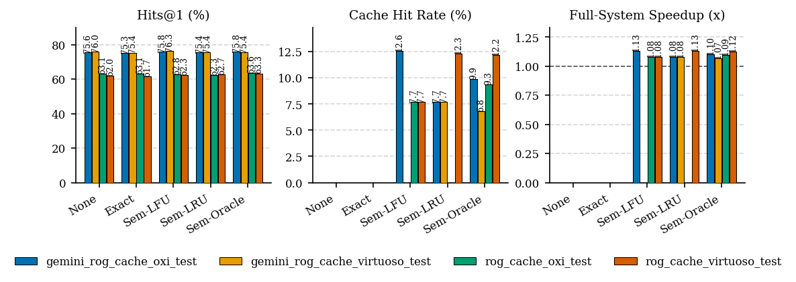
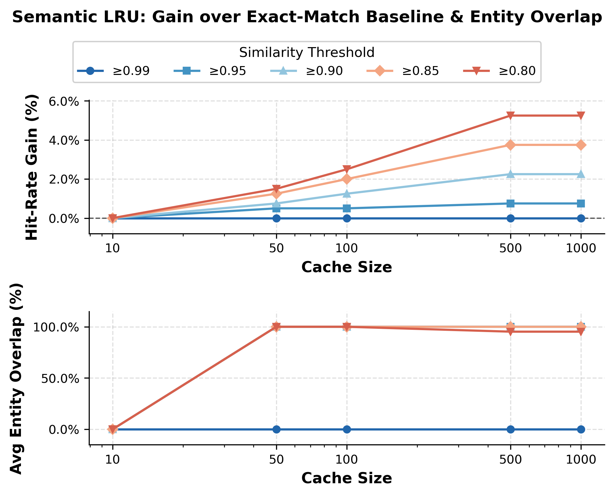

# KG_cash

**Question caching for LLM-guided knowledge graph question answering.**

[](LICENSE)

KGQA systems like [RoG](https://github.com/RManLuo/reasoning-on-graphs) and
[ToG](https://github.com/GasolSun36/ToG) answer a question by making repeated
LLM calls to plan a traversal over a knowledge graph. Those planning calls
dominate latency, and across a benchmark many questions plan *almost the same
traversal*. This repository measures how much of that work a cache can remove —
and whether removing it costs any accuracy.

The cache sits in front of the **planning stage only**. The reasoning stage
always runs against the live KG, so any change in Hits@1 or F1 is caused by
reusing a planned path and nothing else.

```
  RoG    question ──▶ [ planner: LLM → relation paths ] ──▶ [ reasoner: paths + KG → answer ] ──▶ score
                          ▲ cached                              always runs

  ToG    question ──▶ [ iterative traverse: LLM + SPARQL, per loop ] ──▶ answer ──▶ score
                          ▲ cached (question-chain)
```

## Key findings



**Exact-match caching is worthless here.** Across every system, backend, and
model we tested, exact string matching on the question produced a **0.0% hit
rate** — benchmark questions are rarely repeated verbatim. Semantic matching on
question embeddings is what makes a cache viable at all.

**Semantic caching hits, and accuracy holds.** On RoG / WebQSP test
(n=1628, Claude Haiku 4.5, Virtuoso):

| Policy            | Hit rate | Accuracy | F1    |
| ----------------- | -------: | -------: | ----: |
| None (baseline)   |     0.0% |    49.67 | 50.40 |
| Exact match       |     0.0% |    49.60 | 49.78 |
| Semantic LFU      |     7.7% |    49.83 | 49.83 |
| Semantic LRU      |     7.7% |    48.72 | 49.17 |
| Semantic Oracle   |     6.8% |    50.03 | 50.48 |

Accuracy stays within ~1 point of the uncached baseline in every configuration,
so the hits are genuinely reusable plans rather than degraded answers.

**End-to-end speedup is modest; the headroom is in the KG, not the planner.**
Live full-system speedup lands at 1.06×–1.13×. Simulation over captured traces
shows where the remaining time actually is — caching *KG* results at capacity
1000 gives:

| Dataset | Policy       | Hit rate | KG speedup |
| ------- | ------------ | -------: | ---------: |
| WebQSP  | LRU          |    34.6% |      1.35× |
| WebQSP  | Belady (MIN) |    37.1% |      1.47× |
| CWQ     | LFU          |    38.6% |      1.91× |
| CWQ     | Belady (MIN) |    41.5% |      2.09× |

Belady is the offline optimum, so those columns bound what any online policy
can reach.

**Similarity threshold and cache size both matter.** At a 0.99 threshold the
semantic cache degenerates to exact match and gains nothing. Loosening it to
0.80 buys ~5% hit-rate gain over the exact-match baseline, and the gain grows
with cache size up to ~500 entries before flattening. Across the whole range we
swept (0.80–0.95), entity overlap between the incoming question and the cached
hit stays above ~95%, so we see no sign of the cache serving plans for
unrelated questions — the failure mode a looser threshold would be expected to
introduce.



Full figure set in [`artifacts/figures/`](artifacts/figures/), LaTeX tables in
[`artifacts/tables/`](artifacts/tables/).

## Repository layout

| Path                  | Contents                                                                |
| --------------------- | ----------------------------------------------------------------------- |
| `scripts/`            | Experiment runners, simulators, and table/plot generators — start here   |
| `src/RoG-cache/`      | RoG planner/reasoner API, question cache, cache simulators               |
| `src/ToG-cache/`      | ToG runtime (fork), Freebase/WebQSP resources, evaluator                 |
| `src/ToG-2/`          | ToG-2 runtime, Wikidata capture/replay clients                           |
| `src/ToG-1/`          | Reference copy of upstream ToG                                           |
| `characterization/`   | Semantic-overlap and entity-reuse characterization study                 |
| `artifacts/`          | Run summaries, figures, and generated tables                             |
| `datasets/`           | WebQSP, CWQ, and Freebase subsets                                        |
| `docker/`             | Virtuoso, Oxigraph, and RoG server images                                |

Two SPARQL backends serve the same Freebase KG and are interchangeable via
`SPARQL_ENDPOINT` or `--engine`: **Virtuoso** (`:8890`) and **Oxigraph**
(`:7878`).

## Quickstart

Requires Docker with the NVIDIA runtime (for the RoG model server).

```bash
# 0. Configure credentials — see .env.example for every supported variable
cp .env.example .env      # then set LLM_API_KEY, and HF_TOKEN for RoG runs

# 1. Bring up a SPARQL backend (and the RoG server, if running RoG live)
docker compose up -d virtuoso        # or: oxigraph
docker compose up -d rog             # GPU; first start pulls the model

# 2. Run a cache experiment across all policies
python scripts/run_rog_cache_experiment.py \
  --dataset RoG-webqsp \
  --vendor tamu \
  --policies none,exact,semantic_lru,semantic_lfu,semantic_oracle \
  --threshold 0.9 \
  --capacity 4096 \
  --run-tag my_run

# 3. Summarize
python scripts/summarize_tog_cache.py
```

Results land in `artifacts/rog_cache/<run-tag>/summary.{json,csv}`. Only these
summaries are committed — the bulk prediction and cache output is regenerable
and gitignored.

The ToG equivalent is `scripts/run_tog_cache_experiment.py`, and
`scripts/run_tog_cache_sim.py` / `run_rog_cache_sim.py` replay captured traces
through cache policies without spending API calls.

For manual (non-Docker) installation, Freebase loading, and running the ToG
runtime directly, see **[docs/SETUP.md](docs/SETUP.md)**.

## Credit

This work builds on prior KGQA research; see [NOTICE](NOTICE) for the full
attribution list.

- **ToG** — [GasolSun36/ToG](https://github.com/GasolSun36/ToG)
- **ToG-2** — [DataArcTech/ToG-2](https://github.com/DataArcTech/ToG-2)
- **RoG** — [RManLuo/reasoning-on-graphs](https://github.com/RManLuo/reasoning-on-graphs)

Please refer to the upstream repositories for the original implementations,
paper context, and citation information.

## License

Apache License 2.0 — see [LICENSE](LICENSE). Vendored upstream components
retain their own license terms; see [NOTICE](NOTICE).
